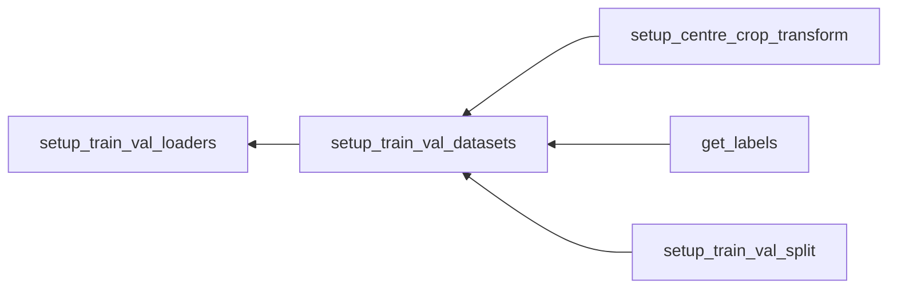

# Create dataset for training

## **Objective**
- The training data has 25,000 images, half of which are of cats and the others are of dogs. 
- We spilt the training data into a training set and a validation set and store them for training with torch. 
- We use the stratified shuffle split which keeps the proportions of the labels in the dataset. 


## **Overview**

### ***Sequence***




### ***Methods***
```python
setup_train_val_loaders(data_dir, batch_size, dryrun=False)
```
- Set splitted datasets as torch.utils.data.DataLoader so that the datasets can be dealt by the subsequent classifier. 
```python
setup_train_val_datasets(data_dir, dryrun=dryrun)
```
- Set splitted datasets as torch.utils.data.Subset so that the dataset loaded can be splitted using their indices. 
```python
setup_centre_crop_transform()
```
- Definition of the way to transform the training images. 
- Four transformations in this case (Resize, CenterCrop, ToTensor, and Normalize).
```python
setup_train_val_split(labels, dryrun=False, seed=0)
```
- Inputs the labels of the data and returns splitted data by their indices. 
```python
get_labels(dataset)
```
- Inputs torch.utils.data.dataset or torch.utils.data.Subset and returns the labels they have. 


## **Details**

### **Libraries needed**

```python
import numpy as np
import os
from sklearn.model_selection import StratifiedShuffleSplit
import torchvision.transforms as transforms
import torch
import torchvision
```


### **setup_train_val_loaders**

```python
def setup_train_val_loaders(data_dir, batch_size, dryrun=False):
    train_dataset, val_dataset = setup_train_val_datasets(
        data_dir, dryrun=dryrun
    )
    train_loader = torch.utils.data.DataLoader(
        train_dataset,
        batch_size = batch_size,
        shuffle = True,
        drop_last = True,
        num_workers = 8
    )
    val_loader = torch.utils.data.DataLoader(
        val_dataset, batch_size = batch_size, num_workers = 8
    )
    
    return train_loader, val_loader
```
- torch.utils.data.DataLoader
  - drop_last: if set True and the dataset size is not divisible by the batch size, the last batch will drop. 
  - num_workers: how many subprocesses to use for data loading. 0 means that the data will be loaded in the main process. 


### **setup_train_val_datasets**

```python
def setup_train_val_datasets(data_dir, dryrun=False):
    dataset = torchvision.datasets.ImageFolder(
        os.path.join(data_dir, "train"),
        transform = setup_centre_crop_transform()
    )
    labels = get_labels(dataset)
    train_indices, val_indices = setup_train_val_split(labels, dryrun)
    
    train_dataset = torch.utils.data.Subset(dataset, train_indices)
    val_dataset = torch.utils.data.Subset(dataset, val_indices)
    
    return train_dataset, val_dataset
```

- The data should be stored like this.
> root/  
> ├ bin/  
> ├ etc/  
> ├ train/  
> ├ cat/  
> │  │ └ files.jpg  
> │  └ dog/  
> │    └ files.jpg  
> └ train/  
>   └ unknown/  
>     └ files.jpg  


- dataset as torchvision.datasets.ImageFolder has imgs method. We can get labels using the second element. 

```python
dataset.imgs[0], dataset.imgs[24000]

#Output
(('/kaggle/working/dogs_vs_cats/train/cat/cat.0.jpg', 0),
 ('/kaggle/working/dogs_vs_cats/train/dog/dog.9099.jpg', 1))
```


- torch.utils.data.Subset is used to make a subset from the entire dataset using their indices. 

```python
train_dataset = torch.utils.data.Subset(dataset, train_indices)

train_dataset.dataset
train_dataset.dataset.imgs
train_dataset.indices

#Output
#Return of train_dataset.dataset
Dataset ImageFolder
    Number of datapoints: 25000
    Root location: /kaggle/working/dogs_vs_cats/train
    StandardTransform
Transform: Compose(
               Resize(size=256, interpolation=bilinear, max_size=None, antialias=None)
               CenterCrop(size=(224, 224))
               ToTensor()
               Normalize(mean=[0.485, 0.456, 0.406], std=[0.229, 0.224, 0.225])

#Return of train_dataset.dataset.imgs
[('/kaggle/working/dogs_vs_cats/train/cat/cat.0.jpg', 0),
 ('/kaggle/working/dogs_vs_cats/train/cat/cat.1.jpg', 0),
 ('/kaggle/working/dogs_vs_cats/train/cat/cat.10.jpg', 0),
 ('/kaggle/working/dogs_vs_cats/train/cat/cat.100.jpg', 0),
 ('/kaggle/working/dogs_vs_cats/train/cat/cat.1000.jpg', 0),
 ('/kaggle/working/dogs_vs_cats/train/cat/cat.10000.jpg', 0),
 ...]

 #Return of train_dataset.indices
 array([ 3851, 12584, 12681,  2395,  8290,  6502,   608, 21590, 15241,
       22340, 24512, 16364, 22535, 13563, 19451, 20563, 13017, 15681,
        7549, 14806,  4013, 13172,  6542, 22873, 22684, 14326,  9496,
       17336, 20402,  7607,  9469, 10524,  8978,  1524, 18578,  4848,
       16950, 16287,  5706, 17117, 14743, 20912,  9904, 20143, 16159,
       10190,  5602, 20282, 22119,    51, 14224, 19240, 10717,  8037,
        8205, 10278,  9587, 23543, 19284,  9945,  5937,  5554,  9063,
        6396, 18160,  3240,  4608, 17036, 23809, 16680, 19835, 23317,
       13847,  8625, 19150,  5352, 19033,  5489,  8503,  5972, 23124,
        7739, 10793, 12174, 13432, 16688, 16199,   565, 21995, 17871,
       17527,  2869, 21407, 15646, 10878, 16824, 17744, 18717, 15899,
       18618])
```


### **setup_centre_crop_transform**

```python
def setup_centre_crop_transform():
    return transforms.Compose(
        [
            transforms.Resize(256),
            transforms.CenterCrop(224),
            transforms.ToTensor(),
            transforms.Normalize([0.485, 0.456, 0.406], [0.229, 0.224, 0.225])
        ]
    )
```


### **get_labels**

```python
def get_labels(dataset):
    if isinstance(dataset, torch.utils.data.Subset):
        return get_labels(dataset.dataset)[dataset.indices]
    else:
        return np.array([img[1] for img in dataset.imgs])
```

- If dataset is torch.utils.data.dataset, then get the labels using imgs method and make they a numpy array. 
- If dataset is torch.utils.data.Subset, then call get_labels itself making Subset.dataset as an input. 


### **setup_train_val_split**

```python
def setup_train_val_split(labels, dryrun=False, seed=0):
    x = np.arange(len(labels))
    y = np.array(labels)
    splitter = StratifiedShuffleSplit(
        n_splits=1, train_size=0.8, random_state=seed
    )
    train_indices, val_indices = next(splitter.split(x, y))
    
    if dryrun:
        train_indices = np.random.choice(train_indices, 100, replace=False)
        val_indices = np.random.choice(val_indices, 100, replace=False)
        
    return train_indices, val_indices
```

